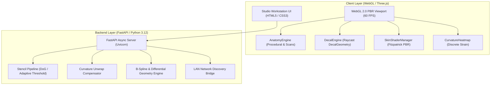

# ⚙️ Technical Architecture & Mathematical Foundation

This document details the engineering specifications, mathematical formulations, WebGL graphics pipeline, and API schemas powering **TattooForge Pro**.

---

## 1. System Architecture



---

## 2. Mathematical Foundation: B-Splines & Differential Geometry

The mathematical foundation in `tattooforge/spline/` models organic surfaces and computes metric tensors for strain and distortion analysis.

### 2.1 Cox-de Boor Recursive Basis Evaluation
For a knot vector $U = \{u_0, u_1, \dots, u_m\}$, the $i$-th B-spline basis function of degree $p$ is defined recursively:

$$N_{i,0}(u) = \begin{cases} 1 & \text{if } u_i \le u < u_{i+1} \\ 0 & \text{otherwise} \end{cases}$$

$$N_{i,p}(u) = \frac{u - u_i}{u_{i+p} - u_i} N_{i,p-1}(u) + \frac{u_{i+p+1} - u}{u_{i+p+1} - u_{i+1}} N_{i+1,p-1}(u)$$

With clamped boundary conditions ensuring partition of unity:

$$\sum_{i=0}^{n-1} N_{i,p}(u) = 1.0 \quad \forall u \in [0, 1]$$

### 2.2 First Fundamental Form (Metric Tensor)
Given a surface patch $\mathbf{S}(u, v) = \sum_{i} \sum_{j} N_{i,p}(u) N_{j,q}(v) \mathbf{P}_{i,j}$, the tangent vectors are:

$$\mathbf{S}_u = \frac{\partial \mathbf{S}}{\partial u}, \quad \mathbf{S}_v = \frac{\partial \mathbf{S}}{\partial v}$$

The unit surface normal is:

$$\mathbf{n} = \frac{\mathbf{S}_u \times \mathbf{S}_v}{\|\mathbf{S}_u \times \mathbf{S}_v\|}$$

The coefficients of the First Fundamental Form measure intrinsic metric distances on the skin:

$$E = \mathbf{S}_u \cdot \mathbf{S}_u, \quad F = \mathbf{S}_u \cdot \mathbf{S}_v, \quad G = \mathbf{S}_v \cdot \mathbf{S}_v$$

### 2.3 Second Fundamental Form & Curvature Invariants
The Second Fundamental Form coefficients measure extrinsic curvature with respect to the normal:

$$L = \mathbf{S}_{uu} \cdot \mathbf{n}, \quad M = \mathbf{S}_{uv} \cdot \mathbf{n}, \quad N = \mathbf{S}_{vv} \cdot \mathbf{n}$$

From the Weingarten equations, the **Gaussian Curvature ($K$)** and **Mean Curvature ($H$)** are derived:

$$K = \frac{LN - M^2}{EG - F^2}$$

$$H = \frac{EN - 2FM + GL}{2(EG - F^2)}$$

The **Principal Curvatures ($k_1, k_2$)** are the eigenvalues of the shape operator:

$$k_1 = H + \sqrt{\max(0, H^2 - K)}, \quad k_2 = H - \sqrt{\max(0, H^2 - K)}$$

---

## 3. WebGL Graphics & Shader Pipeline

### 3.1 Three.js Decal Projection
The decal projection engine projects a 2D texture patch directly onto a 3D polygonal manifold:
1. **Raycasting**: Intersects camera ray with target mesh surface, extracting point $\mathbf{P} \in \mathbb{R}^3$ and normal vector $\hat{\mathbf{n}} \in \mathbb{R}^3$.
2. **Projector Matrix**: Constructs an oriented bounding box whose local $Z$-axis aligns with $\hat{\mathbf{n}}$, with in-plane rotation angle $\theta$:
   $$\mathbf{R} = \text{LookAt}(\mathbf{P} + \hat{\mathbf{n}}, \mathbf{P}, \hat{\mathbf{u}}) \cdot \text{Rot}_Z(\theta)$$
3. **Clipped Polygon Extraction**: Traverses intersecting mesh faces within the projector box dimensions $[W, H, D]$, where depth $D = \max(5.0, 3.0 \cdot \max(W, H))$ provides deep adaptive reach around curved geometry.
4. **Normal-Guided Backside Culling**: Instead of slicing curved surfaces with a shallow bounding box, `DecalGeometry` evaluates the average face normal in projector space ($\bar{n}_z$). Faces with $\bar{n}_z < -0.08$ (facing $> 95^\circ$ away from the projection ray) are discarded immediately. This permits seamless $180^\circ$ wrapping around cylinders, forearms, and ribcages while completely eliminating backside bleed-through.
5. **Z-Fighting Prevention**: Decal vertices receive an incremental offset ($1.5\,\text{mm}$) along their surface normal vector, combined with WebGL polygon offsets (`factor: -2, units: -2`) and `DoubleSide` rendering to guarantee razor-sharp visibility at extreme grazing angles.

### 3.2 PBR Physical Skin Shader
* **Micro-Pore Normal Mapping**: A tangent-space normal map (`skin_normal.png`) generated via Sobel gradients of Gaussian noise simulates dermal pores and micro-creases.
* **Melanin Absorption**: The diffuse base color interpolates across the Fitzpatrick phototypes I through VI based on melanin density $\rho \in [0, 1]$:
  $$\mathbf{C}_{\text{skin}} = \text{lerp}(\mathbf{C}_{\text{Type I}}, \mathbf{C}_{\text{Type VI}}, \rho)$$
* **Fresh Ink Erythema**: In "Fresh Ink" mode, the shader applies a subtle localized redness shift ($\Delta R = +0.02, \Delta G = -0.04$) and raises clearcoat reflectivity ($0.28$) to simulate freshly shaved and sanitized skin.

---

## 4. Stencil Extraction & Curvature Compensation

### 4.1 Difference-of-Gaussians (DoG) Filter
Tattoo thermal copiers (Brother PocketJet, Spirit) require high-contrast black/purple line art. The extraction pipeline applies multi-scale bandpass filtering:

$$\text{DoG}(x, y) = G_{\sigma_2}(x, y) * I(x, y) - G_{\sigma_1}(x, y) * I(x, y)$$

Where $\sigma_1 = 0.5 \cdot \text{line\_weight}$ and $\sigma_2 = 2.5 \cdot \sigma_1$, followed by Otsu adaptive thresholding.

### 4.2 Inverse Arc-Length Compensation
When wrapping a flat 2D rectangle onto a cylinder of radius $R$, arc length on the curved surface relates to projection width $x$ by $x = R \sin(\theta)$. To prevent barrel distortion on the printed stencil:

$$x_{\text{compensated}} = \frac{\arcsin(x \cdot \sin(\theta_{\max}))}{\theta_{\max}}$$

Where $\theta_{\max} = \frac{\text{arc\_span\_degrees}}{2}$.

---

## 5. REST API Specifications

### `GET /api/health`
Returns system status and capabilities list.

### `GET /api/network/info`
Returns local machine IP addresses, hostname, and active studio URL for iPad pairing.

### `POST /api/stencil/process`
* **Content-Type**: `multipart/form-data`
* **Parameters**: `file`, `remove_bg` (bool), `bg_threshold` (int), `line_weight` (int), `threshold_sensitivity` (int), `stencil_color_hex` (str).
* **Response**:
  ```json
  {
    "width": 1200,
    "height": 1600,
    "artwork_transparent_url": "data:image/png;base64,...",
    "stencil_decal_url": "data:image/png;base64,...",
    "thermal_printable_url": "data:image/png;base64,..."
  }
  ```

### `POST /api/stencil/compensate`
* **Content-Type**: `application/json`
* **Payload**: `{"image_data_uri": "...", "cylinder_radius_cm": 4.5, "arc_span_degrees": 110.0}`
* **Response**: `{"compensated_url": "data:image/png;base64,..."}`

### `POST /api/curvature/analyze`
* **Content-Type**: `application/json`
* **Payload**: `{"u": 0.5, "v": 0.5, "control_z": [[...]], "degree": 2}`
* **Response**: Gaussian ($K$), Mean ($H$), and Principal Curvatures ($k_1, k_2$).
